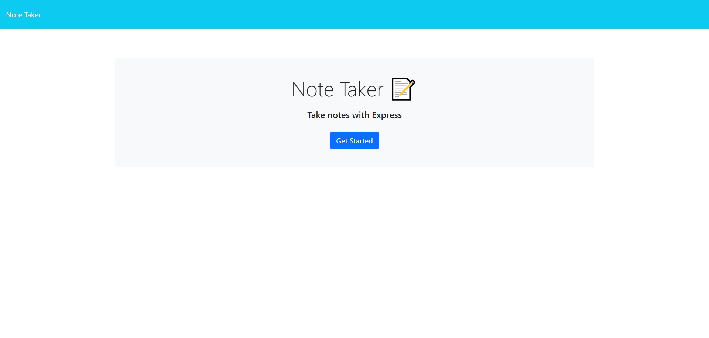
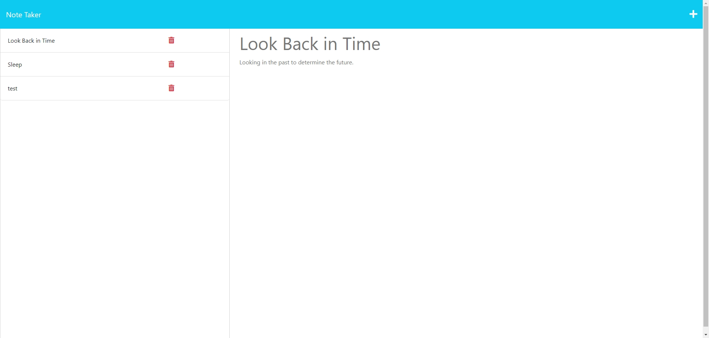
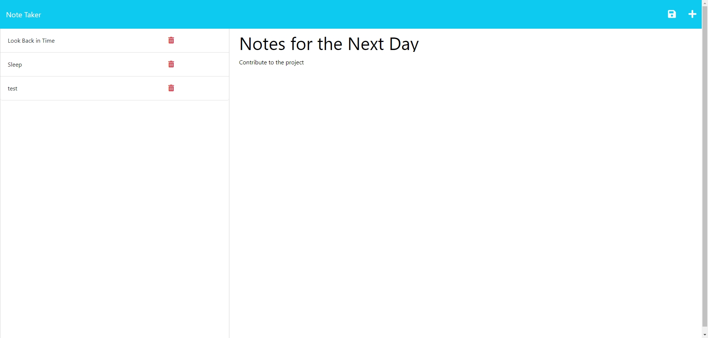
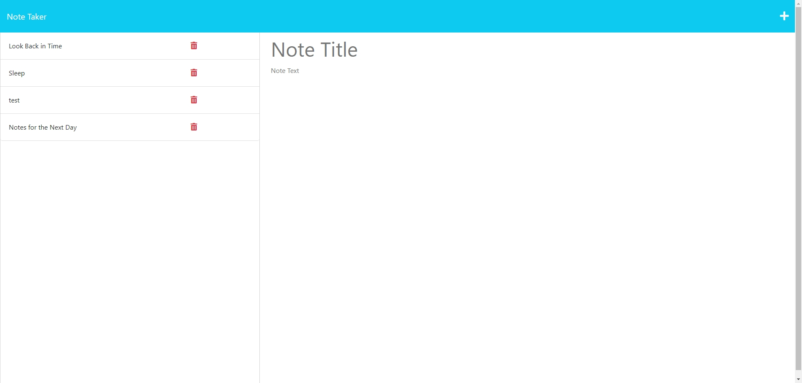

# Note-Taker App

## Description

The movtivation was to create note-taking system that can be of use for the user.

I build this project to understand the way that express is used in node.js and javascript.

It solves the problem for users to take notes and modify any changes.

I learnt that there is a system to use express to recieve and send data through a server.

## Table of Contents (Optional)

If your README is long, add a table of contents to make it easy for users to find what they need.

- [Installation](#installation)
- [Usage](#usage)
- [Credits](#credits)
- [License](#license)
- [Badges](#badges)
- [Features](#features)
- [HowtoContribute](#how-to-contribute)
- [Tests](#tests)

## Installation

1. Download zipped folder in repo site.
2. Open the server.js file through vs code.
3. In the terminal where server.js file is, start node.js with the file name.
4. Go to localhost:3001, and the website will be there.

## Usage

Homepage

Selecting a Note

Typing a Note

Adding a Note

Repo Link: https://github.com/Jasony95/note-taker
Heroku Link: https://note-taking-system-ef9ffc08aa3e.herokuapp.com/notes

## Credits

Collarborators:

Sichoun Nplhaib Lee: https://github.com/DDXP3
Joey Thao: https://github.com/Thaodev23

## License

There is no license used.

## Badges

There is no badges used.

## Features

Project includes saving and examing notes.

## How to Contribute

Bonus is to delete a note which in this case is no finished yet.

## Tests

There is no testing.